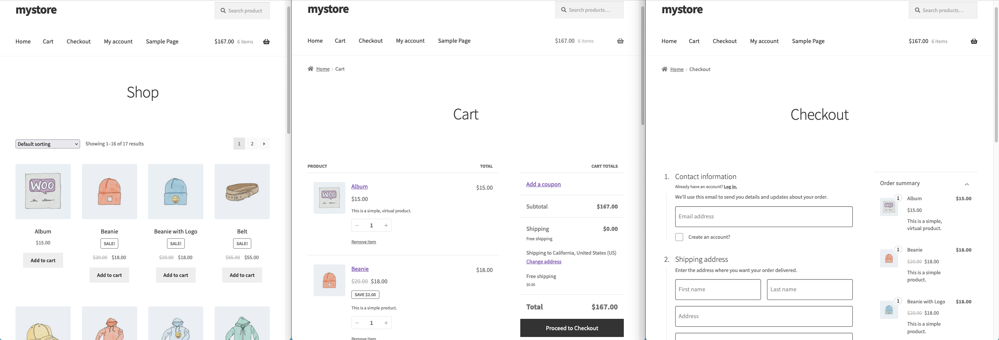
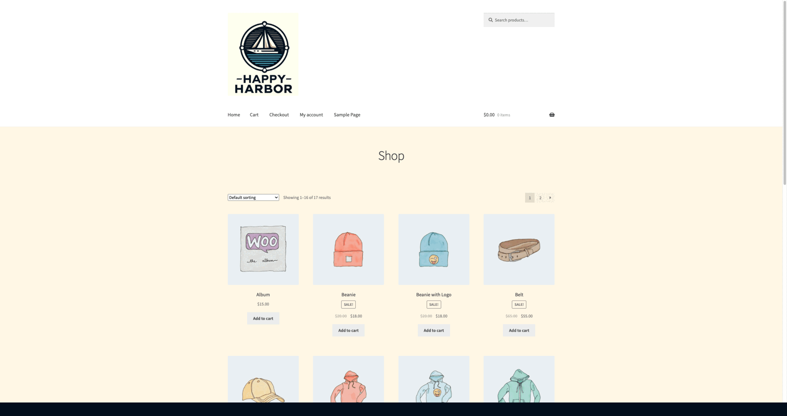
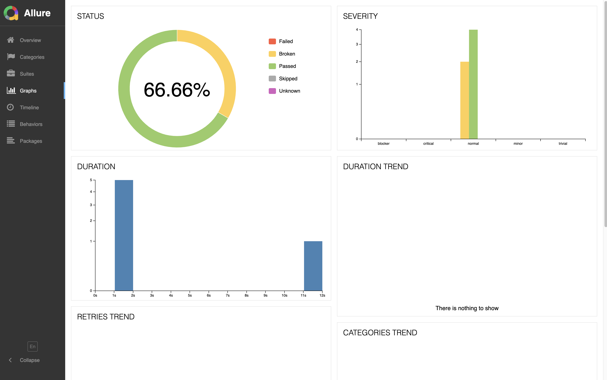
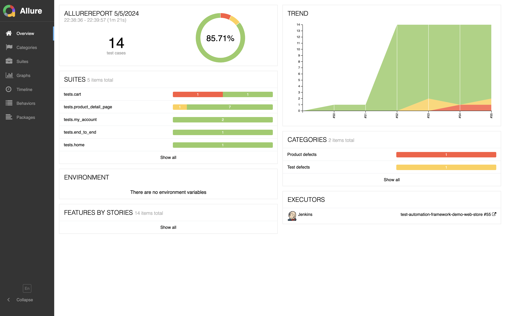

## 📊 Test Automation Framework for the [Demo Web Store](http://happyharbor.com) Application




## Technology Stack
| <a href="https://www.python.org/"></a> | <a href="https://docs.pytest.org/en/8.0.x/contents.html"></a> | <a href="https://www.selenium.dev/"></a> | <a href="https://www.jenkins.io/"></a> | <a href="https://github.com/"></a> | <a href="https://faker.readthedocs.io/en/master/"></a> | <a href="https://www.atlassian.com/software/jira"></a> | <a href="https://allurereport.org/"></a> |<a href="https://docs.qameta.io/allure-testops//"></a> | <a href="https://slack.com/"></a> | <a href="https://www.jetbrains.com/pycharm/"></a> |
|:-----------------------------------------------------------------------------------------------------------------------------:|:----------------------------------------------------------------------------------------------------------------------------------------------------:| :---------: | :---------: |:----------------------------------------------------------------------------------------------------------------------------------:|:-----------------------------------------------------------------------------------------------------------------------:|:-----------------------------------------------------------------------------------------------------------------------------------------:| :---------: | :---------: | :---------: | :---------: | 
|                                                            Python                                                             |                                       Pytest                                                                                                       | Selenium | Jenkins |                                                              GitHub                                                               |                                                          Faker                                                       | Jira | Allure | Allure TO | Slack | PyCharm |

This project utilizes a variety of tools to achieve its automation goals:

* [Python](https://www.python.org/): The main programming language used for writing the test automation framework and tests.
* [Pytest](https://docs.pytest.org/en/latest/): A testing framework in Python, used for organizing and running the tests.
* [Selenium](https://www.selenium.dev/): A tool for automating web browsers, used for writing the UI tests.
* [Faker](https://faker.readthedocs.io/en/master/): is a Python library for generating fake data such as names, addresses, and phone numbers. It's useful for populating test data in automated tests.
* [Jenkins](https://www.jenkins.io/): A continuous integration system used to schedule and run the tests automatically.
* [Jira](https://www.atlassian.com/software/jira): An issue tracking system used for managing project tasks and bugs.
* [Allure Report](http://allure.qatools.ru) and [Allure TestOps](https://docs.qameta.io/allure-testops/): Used to visualize test results in a comprehensive and intuitive report.
* [Slack](https://slack.com/): A communication platform used for team collaboration and notifications about test results.
* [TBD](https://slack.com/) TBD


## Overview
The myStoreWebUI project is a [Python-based](https://www.python.org/) web automation framework designed to interact with an online store's user interface.   
It uses Selenium WebDriver for browser automation and pytest for test organization and execution.  

The project is structured around a Page Object Model (POM) design pattern, which helps to maintain the code and reduce code duplication.                    
Each page of the web application is represented by a Python class, and the interactions with the page are encapsulated as methods on these classes.

The project is designed to be flexible and maintainable, with the ability to add new tests and page classes as the web application evolves.

In addition to UI tests, the framework also includes API tests. These tests interact directly with the web application's backend, verifying the correct operation of the API endpoints. This allows for more comprehensive coverage of the application's functionality, as well as faster and more reliable tests compared to UI tests.

Continuous integration is an essential part of the project, with Jenkins used to automate the test execution process. Jenkins is configured to run the tests on a regular schedule, providing feedback on the application's health and stability.

Notifications are sent to the team via Slack, and test results are visualized using Allure reports and Allure TestOps.

The `myStoreWebUI` test automation framework is built using a modern technology stack that includes Python, Selenium WebDriver, pytest, and Jenkins among others. This combination of technologies allows for robust, scalable, and maintainable automated testing of the web application's user interface.

## Test Scenarios
### User Interface (UI) Test Suite
***Click to Expand</ib>***  👇  
<details>
  <summary> <b> :computer: Test Suite ★ User Authentication </b></summary>

:computer: Test Case ID 1 @ User Authentication @ User Registration \
Objective: Validate the successful registration of a new user account.

:computer: Test Case ID 2 @ User Authentication @ Existing User Login \
Objective: Authenticate an existing user and confirm successful login.

:computer: Test Case ID 3 @ User Authentication @ Non-Existing User Login \
Objective: Attempt to authenticate a non-existing user and verify that the login attempt fails with the appropriate error message.

</details>

<details>
  <summary><b>:computer: Test Suite ★ Home Page </b></summary>

:computer: Test Case ID 8 @ Home Page @ Search for a Specific Product \
Objective: Execute a product search using the search bar and confirm that the search results are correctly displayed.

</details>

<details>
  <summary><b> :computer: Test Suite ★ Product Detail Page </b></summary>

:computer: Test Case ID 10 @ Product Detail Page @ Verify Add to cart button is displayed \
Objective: Validate the correct display of the "Add to Cart" button on the product detail page.

:computer: Test Case ID 11 @ Product Detail Page @ Verify Product Category \
Objective: Validate the correct display of a product's category on the product detail page.

:computer: Test Case ID 12 @ Product Detail Page @ Verify Product Description \
Objective: Validate the correct display of a product's description on the product detail page.

:computer: Test Case ID 13 @ Product Detail Page @ Verify Product Description Header \
Objective: Validate the correct display of the product description header on the product detail page.

:computer: Test Case ID 14 @ Product Detail Page @ Verify Product Image \
Objective: Validate the correct display of a product's image on the product detail page.

:computer: Test Case ID 15 @ Product Detail Page @ Verify Product Price \
Objective: Validate the correct display of a product's price on the product detail page.

:computer: Test Case ID 16 @ Product Detail Page @ Verify Product Name \
Objective: Validate the correct display of a product's name on the product detail page.

:computer: Test Case ID 17 @ Product Detail Page @ Verify Product SKU \
Objective: Validate the correct display of a product's SKU on the product detail page.

</details>

<details >
  <summary><b> :computer: Test Suite ★ Shopping Cart </b></summary>

:computer: Test Case ID 5 @ Shopping Cart Operations @ Remove Product from Cart \
Objective: Add a product to the shopping cart, subsequently remove it, and confirm that the shopping cart is empty.

:computer: Test Case ID 6 @ Shopping Cart Operations @ Update Product Quantity in Cart \
Objective: Adjust the quantity of an existing product in the shopping cart, both increasing and decreasing, and confirm that the shopping cart updates accurately reflecting the correct total price and quantity.

:computer: Test Case ID 7 @ Shopping Cart Operations @ \
Objective: TBD

</details>

<details>
  <summary><b> :computer: Test Suite ★ User Profile </b></summary>
</details>

<details>
  <summary><b> :computer: Test Suite ★ End-to-End Process </b></summary>

:computer: Test Case ID 30 @ End-to-End Process @ Order with Discount Coupon as Guest User \
Objective: Add a product to the shopping cart, apply a discount coupon, and finalize the order as a guest user, ensuring the process completes successfully.

:computer: Test Case ID 31 @ End-to-End Process @ Order with Discount Coupon as Registered User \
Objective: Add a product to the shopping cart, apply a discount coupon, and finalize the order as a registered user, ensuring the process completes successfully.

:computer: Test Case ID 32 @ End-to-End Process @ Order with Multiple Products as Guest User \
Objective: Add multiple products to the shopping cart, finalize the order as a guest user, and confirm that the order is processed successfully.

:computer: Test Case ID 33 @ End-to-End Process @ Order with Multiple Products as Registered User \
Objective: Add multiple products to the shopping cart, finalize the order as a registered user, and confirm that the order is processed successfully.

:computer: Test Case ID 34 @ End-to-End Process @ Order with Multiple Products and Discount Coupon as Guest User \
Objective: Add multiple products to the shopping cart, apply a discount coupon, finalize the order as a guest user, and confirm that the order is processed successfully.

:computer: Test Case ID 35 @ End-to-End Process @ Order with Multiple Products and Discount Coupon as Registered User \
Objective: Add multiple products to the shopping cart, apply a discount coupon, finalize the order as a registered user, and confirm that the order is processed successfully.

</details>


### API Test Suite

<details>
    <summary><b> :gear: API Test Suite </b></summary>

:gear: Test Case ID 42 @ API @ Add Product to Cart with API \
Objective: Utilize the API to add a product to the shopping cart and confirm that the product is added successfully.

:gear: Test Case ID 41 @ API @ Test Case Name \
Objective: Test case objective.

</details>


## Getting Started

To get started with MyStoreWebUI, follow these steps:

1. Ensure you have Python installed on your machine.
2. Install the project's dependencies listed in the `requirements.txt` file using pip:

```bash
pip install -r requirements.txt
```


## To run the tests locally (default):

```
pytest -m tcid1

pytest -m end_to_end

pytest -m smoke

pytest -m regression --alluredir=allure-results

pytest -m api --alluredir=allure-results
```

## Demonstration of a Successful End-to-End Test Case Execution:

This demonstration provides a practical example of how our automated tests validate the entire system, from start to finish, ensuring that all integrated components of the application function as expected.



## Jenkins Job: Configuring Launch Options

Jenkins, as a continuous integration system, plays a crucial role in our test automation framework. It allows us to schedule and automate the execution of our tests, ensuring that our application is continuously validated against our suite of tests.

Here are some possible configurations for setting up Jenkins jobs for our project:

1. **Scheduled Test Runs**: You can configure Jenkins to run the tests at specific times. This is useful for scheduling nightly builds or running tests during off-peak hours.

2. **Triggered Test Runs**: Jenkins can be configured to run tests in response to specific events, such as when code is pushed to the repository or when a pull request is created.

3. **Parameterized Test Runs**: You can set up Jenkins jobs that take parameters. This allows you to run the same set of tests with different configurations or test data.

4. **Parallel Test Runs**: Jenkins supports running jobs in parallel, which can significantly reduce the total test execution time when you have a large number of tests.


## Allure Reports: Generation and Visualization
Allure Reports offer an elegant and user-friendly way to represent test results, making it easier to interpret and analyze test outcomes. The following steps guide you through the process of generating and viewing Allure Reports:

1. **Executing Tests with Allure Integration**: When executing your pytest tests, include the `--alluredir` option followed by the directory where you wish to store the Allure results. For instance:
```bash
# This command will run the regression tests and store the Allure results in the allure-results directory.
pytest -m regression --alluredir=allure-results
```
2. **Generate the Allure report:**:  After the tests have been executed, you can generate the Allure report using the Allure command line tool:
```bash
# This command generates the Allure report and automatically opens it in your default web browser.
allure serve allure-results
```

## Allure Report: Visualizing Test Status and Trends
Allure Reports not only provide a detailed overview of test status but also display trend graphs for a more comprehensive understanding of the test performance over time.





## Allure TestOps: Analyzing Test Execution Results

Allure TestOps provides a comprehensive platform for managing and analyzing test results. It offers a detailed view of test execution outcomes, enabling you to identify and address issues effectively.

The image below presents an instance of a failed automated test, complete with relevant attachments. This level of detail aids in diagnosing the cause of test failures and expedites the debugging process.


## Allure TestOps: Insightful Test Analytics Dashboard

Allure TestOps offers a comprehensive dashboard that provides a high-level overview of test execution results. This dashboard is instrumental in monitoring the overall health and progress of your testing efforts.

The image below showcases the Allure TestOps dashboard, which presents a visual summary of test outcomes, enabling quick identification of trends and potential issues.


## Allure TestOps: Detailed Analytics on Success and Duration Rates

Allure TestOps provides in-depth analytics that offer insights into the success and duration rates of your tests. These metrics are crucial for understanding the efficiency and reliability of your testing processes.

The image below illustrates the Allure TestOps analytics dashboard, displaying the success rate and duration rate of various tests. This data visualization aids in identifying patterns, trends, and potential areas of improvement in your testing strategy.


## Jira Integration: Attaching Test Results and Test Launch Details to Jira Tickets

Our testing framework is integrated with Jira, a widely-used issue tracking system. This integration allows us to attach test results and details of test launches directly to the corresponding Jira tickets. This feature enhances traceability and provides a comprehensive view of the testing process within the context of each issue.

The image below demonstrates a Jira ticket with attached test results and test launch details.


## Slack: Real-Time Test Execution Notifications

Slack, as a real-time communication platform, plays a pivotal role in our test automation framework. It enables us to send instant notifications about the status of test executions, keeping the team updated about the progress and results of our testing efforts.

The image below illustrates a typical Slack notification generated by our testing framework.


